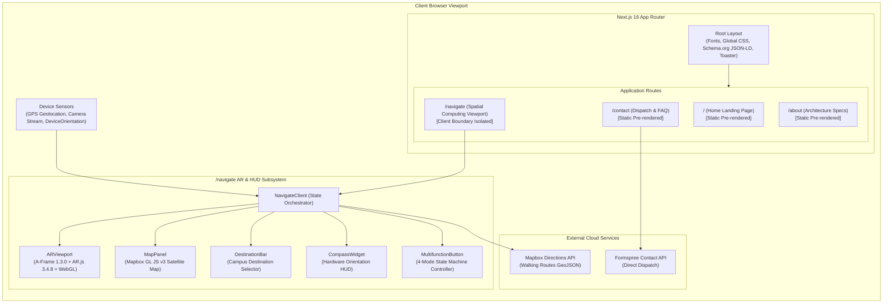
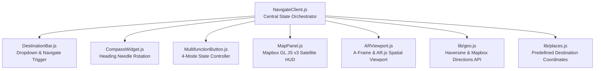
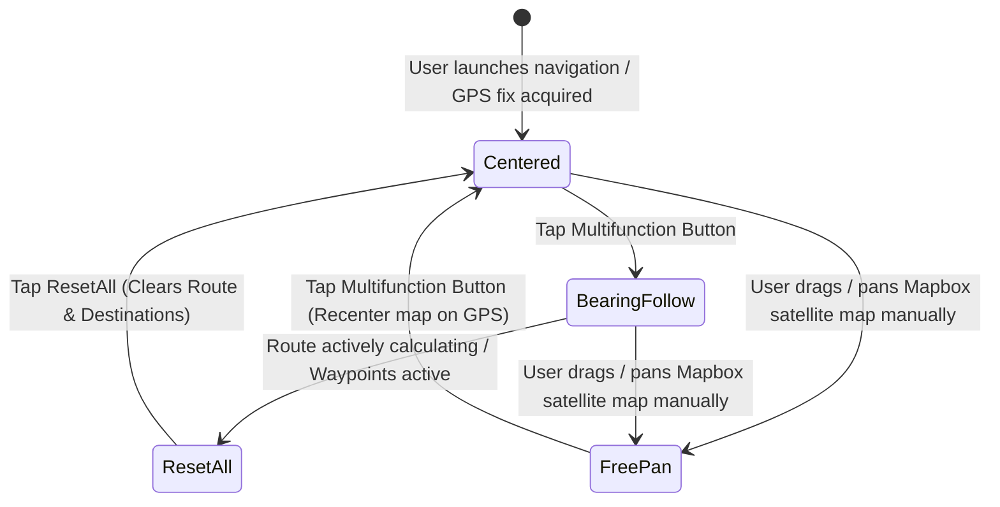

# EnRouteAR — System Architecture

This document describes the architectural design, component hierarchy, spatial computing pipeline, and state machine powering EnRouteAR.

---

## 1. High-Level System Architecture



---

## 2. Server & Client Component Boundaries

Next.js 16 App Router enforces clear separation between server-executed rendering and browser-only interactive runtimes.

| Route | Rendering Mode | Component Type | Responsibility |
|---|---|---|---|
| `/` | Static (SSG) | Server Component | High-performance hero, feature grids, campus summary, and footer. Client-only interactivity (canvas, menu) isolated to micro-components. |
| `/about` | Static (SSG) | Server Component | Structural specifications, architectural pillar cards, institutional history, and breadcrumb JSON-LD. |
| `/contact` | Static (SSG) | Server Component | Institutional headquarters info, FAQ accordions, and breadcrumb JSON-LD. Isolated client boundary for `ContactForm.js`. |
| `/navigate` | Dynamic Client | Client Component (`NavigateClient`) | Full browser-only spatial computing environment accessing `navigator.geolocation`, `navigator.mediaDevices`, `window.DeviceOrientationEvent`, and WebGL canvases. |
| `/robots.txt` | Metadata Route | Server Route Handler (`robots.js`) | Search crawler rules and dynamic sitemap indexing reference. |
| `/sitemap.xml` | Metadata Route | Server Route Handler (`sitemap.js`) | Dynamic XML sitemap indexing all application routes with change frequencies. |

---

## 3. AR Navigation Subsystem Architecture

The `/navigate` route is orchestrated by [`web/src/components/navigation/NavigateClient.js`](file:///c:/Users/manis/Projects/EnRouteAR/web/src/components/navigation/NavigateClient.js), which acts as the central coordinator between five focused child components:



### 1. `ARViewport.js` (3D Spatial Computing Engine)
- **Lifecycle & Script Loading**: Loads A-Frame 1.3.0, AR.js 3.4.8, and Three.js extensions dynamically from local static vendor files ([`web/public/vendor/`](file:///c:/Users/manis/Projects/EnRouteAR/web/public/vendor)).
- **Camera Initialization**: Solicits user permission for the environment (rear) camera stream via `navigator.mediaDevices.getUserMedia({ video: { facingMode: 'environment' } })`.
- **Scene Construction**: Injects an `<a-scene>` element with `embedded`, `vr-mode-ui="enabled: false"`, and `arjs="sourceType: webcam; debugUIEnabled: false;"`.
- **Geospatial Anchoring**: Uses `gps-new-camera` to track real-world GPS coordinates and lock AR entities using physical latitude/longitude attributes.
- **Waypoint Rendering**:
  - Interpolated route segments are rendered as glowing 3D cylinders (`<a-cylinder color="#00B4FF" radius="0.25" height="1.2">`).
  - The destination is rendered using the custom GLB mesh (`/models/map_pointer_3d_icon.glb`) with an animated scale pulse.

### 2. `MapPanel.js` (Interactive Satellite HUD)
- **Mapbox Initialization**: Instantiates Mapbox GL JS v3 with the `mapbox://styles/mapbox/satellite-streets-v12` tileset.
- **User Location Tracking**: Adds a custom pulsed radar marker at the user's coordinates.
- **Polyline Rendering**: Injects GeoJSON vector sources (`route`) with outer glow (`route-casing`) and solid cyan walking paths.
- **Gestural Decoupling**: Detects touchstart / pan drag gestures on the map canvas to automatically decouple tracking and transition the state machine into manual `recenter` mode.

### 3. `MultifunctionButton.js` (Tactile 4-Mode Controller)
The multifunction button coordinates the viewport camera lock, compass heading follow, and route reset operations.



| State | CSS Class | Icon | Action on Tap |
|---|---|---|---|
| **Centered** | `.centered` | `centered.png` | Activates bearing follow mode (`bearing`). |
| **Bearing Follow** | `.bearing` | `bearing.png` | Aligns map to current device heading. |
| **Free Pan** | `.recenter` | `recenter.png` | Smoothly flies satellite map back to user location and re-engages `centered` mode. |
| **Reset Active** | `.reset-all` | `reset-all.png` | Clears active route polylines, removes AR cylinders, and resets destination selector. |

### 4. `CompassWidget.js` (Hardware Heading HUD)
- Listens to browser `deviceorientation` events (or WebKit compass headings).
- Applies hardware-accelerated CSS transforms (`transform: rotate(-heading deg)`) with a linear transition to eliminate jitter.

### 5. `DestinationBar.js` (Destination Selector)
- Provides an accessible dropdown containing the 15 pre-mapped KITS Ramtek destinations.
- Dispatches destination updates to `NavigateClient`, enabling the "Navigate" button.
- Includes a dedicated "Return to Home" button for clean client-side routing back to `/`.

---

## 4. Geospatial Routing & Interpolation Pipeline

The routing pipeline bridges the distance between coarse GPS walking segments and fine-grained AR entity placement:

```mermaid
sequenceDiagram
    autonumber
    actor User
    participant DB as DestinationBar
    participant NC as NavigateClient
    participant Geo as lib/geo.js
    participant Mapbox as Mapbox Directions API
    participant AR as ARViewport
    participant MP as MapPanel

    User->>DB: Select "Library" & click "Navigate"
    DB->>NC: onSelectDestination({ name: 'Library', lat, lng })
    NC->>Geo: getWalkingDirections(userLocation, destinationLocation)
    Geo->>Mapbox: GET /directions/v5/mapbox/walking/{start};{end}
    Mapbox-->>Geo: GeoJSON LineString coordinates
    Geo-->>NC: Parsed route geometry [lng, lat][]
    
    NC->>Geo: interpolateRouteCoordinates(routeCoords, stepMeters=2)
    Geo-->>NC: 2-meter interpolated discrete points [lng, lat][]
    
    par Update Satellite Map
        NC->>MP: setRouteCoordinates(routeCoords)
        MP->>MP: Render GeoJSON polyline layers
    and Update AR Viewport
        NC->>AR: setRouteWaypoints(interpolatedPoints)
        AR->>AR: Inject 3D <a-cylinder> entities & <a-entity gltf-model>
    end
```

### Mathematical Formulations
- **Haversine Distance**: Calculates spherical surface distance across Earth's radius ($R = 6,371,000 \text{ m}$):
  $$\Delta \sigma = 2 \arcsin \left( \sqrt{\sin^2\left(\frac{\Delta \phi}{2}\right) + \cos(\phi_1)\cos(\phi_2)\sin^2\left(\frac{\Delta \lambda}{2}\right)} \right)$$
  $$\text{Distance} = R \cdot \Delta \sigma$$
- **Linear Step Interpolation**: Slices polyline segments into $2\text{ m}$ discrete intervals so AR waypoints form a continuous path on the user's screen.

---

## 5. Technical Decisions & Rationale

1. **Vendor Script Distribution for A-Frame / AR.js**:
   - *Decision*: A-Frame (`aframe.min.js`) and AR.js (`aframe-ar.js`) are loaded from `web/public/vendor/` rather than imported via npm.
   - *Rationale*: A-Frame modifies global DOM prototypes and expects `window.THREE` in the global scope. Bundling A-Frame through Turbopack or Webpack causes severe SSR crashes and namespace collisions. Isolating them into static client vendor scripts loaded only inside `ARViewport.js` ensures zero overhead on other pages.
2. **Mobile Viewport Resilience (`100dvh`)**:
   - *Decision*: The navigation viewport uses CSS `h-[100dvh]` rather than `100vh`.
   - *Rationale*: Mobile browser address bars collapse and expand dynamically during orientation changes. Using dynamic viewport height (`100dvh`) prevents UI buttons and Mapbox containers from being pushed off-screen.
3. **Multi-Touch Map Isolation**:
   - *Decision*: Map container styles utilize `touch-action: none` with explicit pointer-event controls.
   - *Rationale*: Prevents whole-page pull-to-refresh gestures from hijacking the 2D satellite map during two-finger rotation or pinch-to-zoom.
