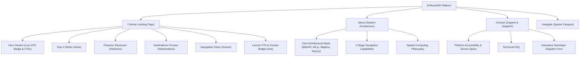

# EnRouteAR — Next.js Application (`web/`)

**Browser-Native Augmented Reality Wayfinding & Spatial Navigation Platform**

EnRouteAR fuses browser-native augmented reality with real-time GPS positioning and live satellite cartography. Built on **Next.js 16** with **React 19**, **Tailwind CSS v4**, **A-Frame**, **AR.js**, and **Mapbox GL JS v3**, EnRouteAR enables users to navigate physical outdoor spaces with sub-meter accuracy directly inside standard mobile web browsers—eliminating the need for native app downloads or proprietary hardware.

---

## Table of Contents

- [Overview & Product Direction](#overview--product-direction)
- [Key Features](#key-features)
- [Information Architecture](#information-architecture)
- [Technology Stack](#technology-stack)
- [Tailwind CSS v4 Architecture](#tailwind-css-v4-architecture)
- [Directory Structure](#directory-structure)
- [Getting Started](#getting-started)
- [Environment Configuration](#environment-configuration)
- [Spatial Navigation Subsystem](#spatial-navigation-subsystem)
- [Accessibility & Responsive Design](#accessibility--responsive-design)
- [Production Build & Quality Verification](#production-build--quality-verification)

---

## Overview & Product Direction

EnRouteAR is designed as a **location-independent, general-purpose navigation platform**. The application projects 3D digital waypoints, distance markers, and turn-by-turn guidance directly onto the user's camera feed.

- **Universal Spatial Navigation**: Designed for complex architectural complexes, expansive facilities, event grounds, and urban environments worldwide.
- **Location-Independent Architecture**: All UI layers, headings, metadata, and user journeys are completely decoupled from any single institution. The pre-calibrated landmark dataset in `lib/places.js` serves as a verified sample test suite while maintaining full coordinate accuracy for live GPS testing, preparing for the upcoming search-based location system.
- **Zero-Install WebXR**: Operates entirely within standard mobile browsers supporting WebGL, Geolocation, and Camera APIs.

---

## Key Features

| Capability | Specification | Implementation |
|---|---|---|
| **Real-Time AR Overlays** | 3D route cylinders & animated GLB pin | A-Frame 1.3.0 + AR.js Location-Based Framework |
| **Interactive Satellite HUD** | 60 FPS satellite-streets mini-map with live polyline | Mapbox GL JS v3 + Mapbox Directions API |
| **Compass-Corrected Bearing** | Heading needle & auto-rotating satellite bearing | DeviceOrientation API with RAF smoothing |
| **4-Mode Controller** | Centered &harr; Bearing &harr; Free Pan &harr; Reset All | Finite state machine in `MultifunctionButton.js` |
| **Sub-Meter Route Interpolation** | 2-meter waypoint intervals along walking trails | Spherical Mercator & Haversine interpolation (`lib/geo.js`) |
| **Responsive HUD Design** | Mobile-first with safe-area notch insets | Tailwind CSS v4 CSS-first token configuration |

---

## Information Architecture

The website features an intentional, non-duplicative information architecture:



- **Landing Page (`/`)**: Focuses on quick-scan value, platform feature cards (`#features`), how it works (`#how`), and direct conversion (`Launch AR`). An invisible `#about` target preserves backward compatibility for legacy links.
- **Dedicated About Page (`/about`)**: Single source of truth for deep system architecture, WebXR rendering pipelines, geospatial projections, and engineering specifications.
- **Dedicated Contact Page (`/contact`)**: Centralized support and feedback hub containing device sensor requirements, FAQs, and the interactive Formspree submission form.
- **Navigation Viewport (`/navigate`)**: Fullscreen, isolated spatial computing interface with camera pass-through, satellite mini-map HUD, compass, and destination selector.

---

## Technology Stack

- **Framework**: Next.js 16.3+ (App Router, Turbopack, React 19)
- **Styling**: Tailwind CSS 4.3+ (PostCSS plugin, `@theme` directives)
- **3D & AR Runtime**: A-Frame 1.3.0, AR.js 3.4.8 (Location-only), Three.js
- **Mapping & Geodesy**: Mapbox GL JS 3.20+, Mapbox Directions API v5
- **Icons**: Lucide React + custom inline SVGs for performance-critical UI
- **Notifications**: Sonner 2.0+ (accessible dark-mode toast system)

---

## Tailwind CSS v4 Architecture

EnRouteAR uses the modern CSS-first configuration model of Tailwind CSS v4 in `src/app/globals.css`:

```css
@import "tailwindcss";

@theme {
  --color-bg: #07111E;
  --color-bg-alt: #0A1627;
  --color-t1: #EAF0F8;
  --color-t2: #B1C0D4;
  --color-t3: #8EA0B8;
  --color-line: rgba(150, 185, 235, 0.16);
  --color-line-bright: rgba(150, 185, 235, 0.34);
  --color-route: #4C8DFF;
  --color-signal: #FFC53D;
  --color-green: #3DDC97;
  --color-err: #FF9188;

  --font-display: var(--font-bricolage), "Bricolage Grotesque", system-ui, sans-serif;
  --font-body: var(--font-public-sans), "Public Sans", system-ui, sans-serif;
}
```

### Key Custom Utilities:
- `@utility glass-spotlight`: Glassmorphism card surface reacting dynamically to cursor pointer movement via CSS custom properties (`--mx`, `--my`).
- `@utility glass-panel`: Static frosted glass styling for menus, dialogs, and HUD components.
- **Reduced Motion Support**: Automatic fallback disabling transforms and animations for users with `prefers-reduced-motion: reduce`.

---

## Directory Structure

```
web/
├── public/
│   ├── icons/                 # SVG compass & multifunction control symbols
│   ├── models/                # 3D destination pointer mesh (.glb)
│   ├── vendor/                # Local A-Frame & AR.js runtime scripts
│   ├── logo-transparent-*.png # High-res brand vector and raster logos
│   └── web-app-manifest-*.png # PWA application icons
├── src/
│   ├── app/
│   │   ├── about/             # Dedicated system architecture page
│   │   ├── contact/           # Dedicated support & developer dispatch page
│   │   ├── navigate/          # Fullscreen AR & satellite HUD viewport
│   │   ├── error.js           # Root error boundary
│   │   ├── globals.css        # Tailwind CSS v4 theme & third-party DOM overrides
│   │   ├── layout.js          # Root layout with fonts, toaster & JSON-LD
│   │   ├── loading.js         # Root suspense fallback
│   │   ├── not-found.js       # Custom 404 coordinate unresolved page
│   │   ├── page.js            # Landing page route
│   │   ├── robots.js          # Dynamic crawler directive route
│   │   └── sitemap.js         # Dynamic XML sitemap route
│   ├── components/
│   │   ├── common/            # Atmosphere, Button, Icons, SpotlightTracker
│   │   ├── landing/           # Header, Footer, Hero, How, Features, Destinations, CTA
│   │   ├── navigation/        # ARViewport, MapPanel, CompassWidget, DestinationBar, MFB
│   │   └── seo/               # Structured data schemas (WebApplication, Org, Breadcrumbs)
│   └── lib/
│       ├── geo.js             # Haversine distance, waypoint interpolation, Mapbox API
│       └── places.js          # Predefined destination coordinate dataset
├── eslint.config.mjs          # ESLint flat config
├── next.config.mjs            # Next.js compiler settings
├── package.json               # Dependencies and build scripts
└── postcss.config.mjs         # PostCSS Tailwind plugin configuration
```

---

## Getting Started

### Prerequisites
- Node.js 18.17+ or 20+
- Modern smartphone with rear camera and GPS sensor (for live AR testing)
- HTTPS connection (mandatory for camera and geolocation APIs in browsers)

### Installation & Run

```bash
# 1. Install dependencies
npm install

# 2. Run local development server
npm run dev

# 3. Build optimized production bundle
npm run build

# 4. Start production server
npm run start

# 5. Run ESLint checks
npm run lint
```

---

## Environment Configuration

Configure `web/.env.local` for local development:

```env
# Canonical base URL for SEO and social preview cards
NEXT_PUBLIC_APP_URL="https://enroutear.vercel.app"

# Mapbox public token for satellite tiles & walking route calculations
NEXT_PUBLIC_MAPBOX_ACCESS_TOKEN="pk.your_mapbox_public_token"

# Formspree endpoint for the direct contact dispatch form
NEXT_PUBLIC_FORMSPREE_ENDPOINT="https://formspree.io/f/mgegpkeb"
```

---

## Spatial Navigation Subsystem

When navigating (`/navigate`), the application coordinates five modular components:

1. **`ARViewport.js`**: Loads local A-Frame/AR.js runtimes sequentially, obtains the webcam stream, and renders glowing 3D cylinders along interpolated walking segments.
2. **`MapPanel.js`**: Renders the 2D satellite-streets map with GPS radar pulsing, turn-by-turn route polyline, and gesture-decoupled panning.
3. **`MultifunctionButton.js`**: Tactile controller cycling through:
   - `centered`: Map follows user position.
   - `bearing`: Map rotates to match heading.
   - `recenter`: Re-engages GPS follow after manual user drag.
   - `reset-all`: Clears active route and resets waypoints.
4. **`CompassWidget.js`**: Real-time rotating needle synced with hardware orientation sensors.
5. **`DestinationBar.js`**: Accessible dropdown providing one-tap destination selection and route generation.

---

## Accessibility & Responsive Design

- **Semantic HTML**: Standard landmarks (`<header>`, `<main>`, `<nav>`, `<section>`, `<footer>`).
- **WCAG Compliance**: High contrast ratios across dark HUD themes (`#EAF0F8` primary text on `#07111E` background).
- **Interactive States**: Explicit `:focus-visible` outlines, accessible button states (`aria-busy`, `aria-label`), and form validation with polite announcements (`role="status"`).
- **Safe Area Insets**: Notch, dynamic island, and home indicator padding via `env(safe-area-inset-top)` and `env(safe-area-inset-bottom)`.
- **Keyboard Navigation**: Skip-to-content links and accessible escape-key modal dismissals.

---

## Production Build & Quality Verification

All pages and routes are verified for production readiness:

```bash
npm run lint   # Passes with 0 errors, 0 warnings
npm run build  # Static pre-rendering (SSG) across all 13 routes in < 2 seconds
```
